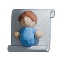

UniversalLocalScripts
========================



UniversalLocalScripts is a module that allows Roblox LocalScripts to run in locations like the workspace, including the currentCamera and other players' characters.

### Why run local scripts in the workspace?

In other popular game engines -- such as Unity and Godot -- scripts will run regardless of what object they're attached to. This can make keeping code organized easier as any code relevant to an object and that operates on that object will likely be attached to it or descended from it instead of sitting in some random folder like StarterPlayerScripts.

UniversalLocalScripts aims to make LocalScript placement more intuitive from that perspective by allowing LocalScripts to run in a wider variety of locations.

#### Example 1

Imagine you want to make a particle effect play at a character's feet when they jump. Seems easy, right? 

First, have a server script weld a part to the player's HumanoidRootPart close to where their feet are

```lua
-- located in game.StarterPlayer.StarterCharacterScripts

local part = script.Part
part.Parent = script.Parent
part.LocalScript.Enabled = true

local weld = Instance.new("Weld")
weld.C1 = CFrame.new(0,-2.5,0)
weld.Part0 = part
weld.Part1 = script.Parent:WaitForChild("HumanoidRootPart")
weld.Parent = part

game.Debris:AddItem(script)

--[[
	Remember to make the part cancollide false and massless in the properties window.
]]
```

 give the part a particle emitter, and write a LocalScript to activate the particles

```lua
-- located in the part

local part = script.Parent
local particles = part:WaitForChild("ParticleEmitter")
local character = part.Parent
local humanoid : Humanoid = character:WaitForChild("Humanoid")

humanoid.Jumping:Connect(function()
	particles:Emit(3)
end)
```
Here's what our explorer looks like:


And just like that, you have particles appear at your feet when you jump!


But there's a problem: when another player connects, you don't see the particles appear on them when they jump. You only see them on your own character. How do you fix this?

Well, you know how intuitive it was to place the script for your character's jumping particles somewhere in StarterCharacterScripts so there would be one of this script in everyone's character? Well fixing this the usual way without UniversalLocalScripts requires you to do away with that and instead place a LocalScript somewhere like StarterPlayerScripts with some code like this:

```lua
function monitorCharacter(character : Model)
	local part = character:WaitForChild("Part")
	local particles = part:WaitForChild("ParticleEmitter")
	local humanoid : Humanoid = character:WaitForChild("Humanoid")

	humanoid.Jumping:Connect(function()
		particles:Emit(3)
	end)
end

function monitorPlayer(player : Player)
	player.CharacterAdded:Connect(monitorCharacter)
	if player.Character then monitorCharacter(player.Character) end
end

game.Players.PlayerAdded:Connect(monitorPlayer)
for i, player in ipairs(game.Players:GetPlayers()) do
	monitorPlayer(player)
end
```
This is also how Roblox's default character audio script works, but this is somewhat awkward. With UniversalLocalScripts however, we don't really need to modify much at all from the original example with the LocalScript copied into everyone's characters via StarterCharacterScripts! All we need to do is insert the UniversalLocalScripts module into ReplicatedFirst and add the following code to the top of the LocalScript: (or use the plugin mentioned later to change the default contents of new LocalScripts)

```lua
local UniversalLocalScripts = require(game.ReplicatedFirst.UniversalLocalScripts)
local script = UniversalLocalScripts.GetOriginal(script) or script
local HasAuthority = UniversalLocalScripts.GetAuthoritativePlayer(script) == game.Players.LocalPlayer
```
And give the LocalScript a boolean attribute named "RunUniversally" and set it to true.

And just like that the particles work for the local player's character as well as everybody else's character! It even would work unmodified for NPCs! What? it's not actually working all the time? Don't worry, that's just Roblox's Humanoid being broken and not always firing the jump event. (ever noticed how you can't hear other players' jump sounds half the time either? Same bug.)

#### Example 2

Let's say you want a coin to spin. Seems easy, right? Just place an anchored coin model in the workspace and put a server script in it with some code like this:

```lua
local RunService = game:GetService("RunService")
local Coin = script.Parent
local DefaultCFrame = Coin.CFrame

RunService.Stepped:Connect(function(totalTime : number)
	Coin.CFrame = DefaultCFrame * CFrame.new(0,math.sin(totalTime * 8) * .5,0) * CFrame.Angles(0,math.rad(totalTime * 360),0)
end)
```

But there's a problem: the movement of the coin looks kind of choppy and stutters a lot in a published game, and having a lot of coins will start to tax your network performance. It sure would be better to make the coin spin using a LocalScript, right? How do you do that though?

Well, you'd probably need to put all the coins in one model and have a LocalScript in StarterPlayerScripts itterate over all of them. Doesn't lend a lot of flexibility to how you can sort your hierarchy. You also end up with a lot of scripts unrelated to the player in StarterPlayerScripts everytime you want to add something like this.

With UniversalLocalScripts however, all we have to do is insert the ULC module into ReplicatedFirst, convert the above server script into a LocalScript, and add the following code to the top: (or use the plugin mentioned later to change the default contents of new LocalScripts)

```lua
local UniversalLocalScripts = require(game.ReplicatedFirst.UniversalLocalScripts)
local script = UniversalLocalScripts.GetOriginal(script) or script
local HasAuthority = UniversalLocalScripts.GetAuthoritativePlayer(script) == game.Players.LocalPlayer
```

And give the LocalScript a boolean attribute named "RunUniversally" and set it to true.

And now we get a coin with smooth movement and zero network strain.


The nice thing here is that if you also have a server script in the coin that handles detecting when a player picks it up you can have all server scripts, module scripts, and local scripts that operate on this coin located inside of it and they all can get destroyed at once when the coin gets picked up and destroyed. This also makes copying this coin into another project easier as it doesn't require hunting around for scripts installed in other weird locations and moving them over to the new project.

If you'd like to see the place file for these examples, just download Example.rbxl.

### Is pasting those 3 lines of code over and over a pain?

Not with the Roblox Studio plugin that I made. [Check out Default LocalScript changer](https://github.com/Noobot9k/DefaultLocalScripts). It's intelligent enough to only put in the needed lines of code in places a LocalScript would need them to run (such as when you create a new LocalScript in the workspace or StarterCharacterScripts and leave them out when created elsewhere. An added feature of this plugin is that you can customize the default contents of LocalScripts to be whatever you want! Just in case you want a little more than just `Print("Hello World!")`.

## Setup

1.a) If you're using Rojo, you can clone this repository. [Rojo](https://github.com/rojo-rbx/rojo) 7.4.1.

1.b) If you're just working in Roblox Studio, you can insert [this package](https://create.roblox.com/store/asset/16890358871/UniversalLocalScripts-v20) into ReplicatedFirst, or download the latest version from the [releases page](https://github.com/Noobot9k/UniversalLocalScripts/releases/) and instert that into ReplicatedFirst.

2.) Select the ModuleScript in ReplicatedFirst called UniversalLocalScripts and configure its attributes to your liking.

3.) Add the following code to the top of any LocalScripts that wouldn't normally run without UniversalLocalScripts but will now such as those in the workspace or StarterCharacterScripts:

```lua
local UniversalLocalScripts = require(game.ReplicatedFirst.UniversalLocalScripts)
local script = UniversalLocalScripts.GetOriginal(script) or script
local HasAuthority = UniversalLocalScripts.GetAuthoritativePlayer(script) == game.Players.LocalPlayer
```

And give the LocalScript a boolean attribute named "RunUniversally" and set it to true.

If you don't want to manually do that every time, consider installing the [Default LocalScript changer Studio plugin](https://github.com/Noobot9k/DefaultLocalScripts) to auto-add this code to the top of all LocalScripts you create in the workspace/StarterCharacterScripts as well as auto-add the attribute.

And that's it!
